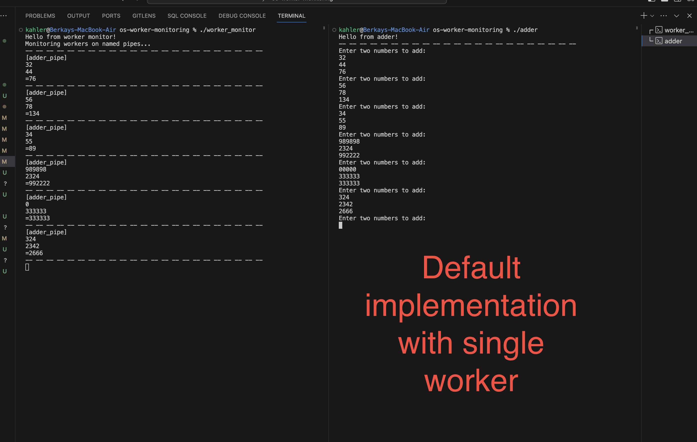
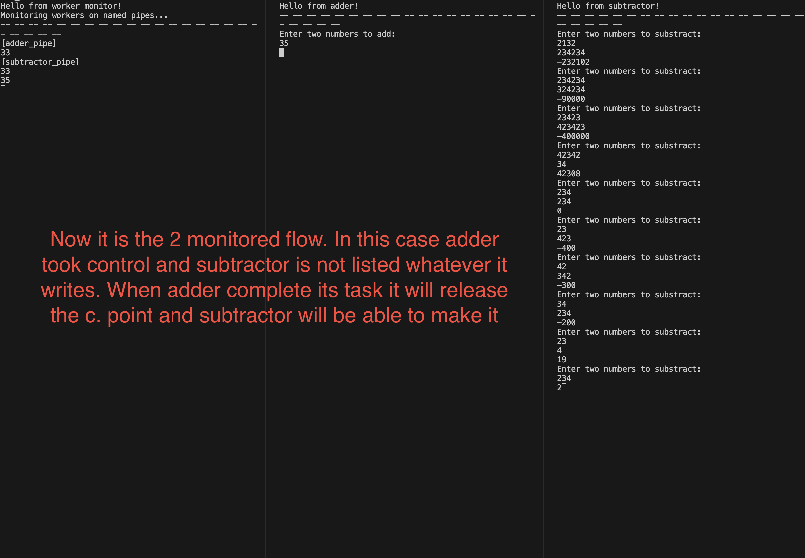
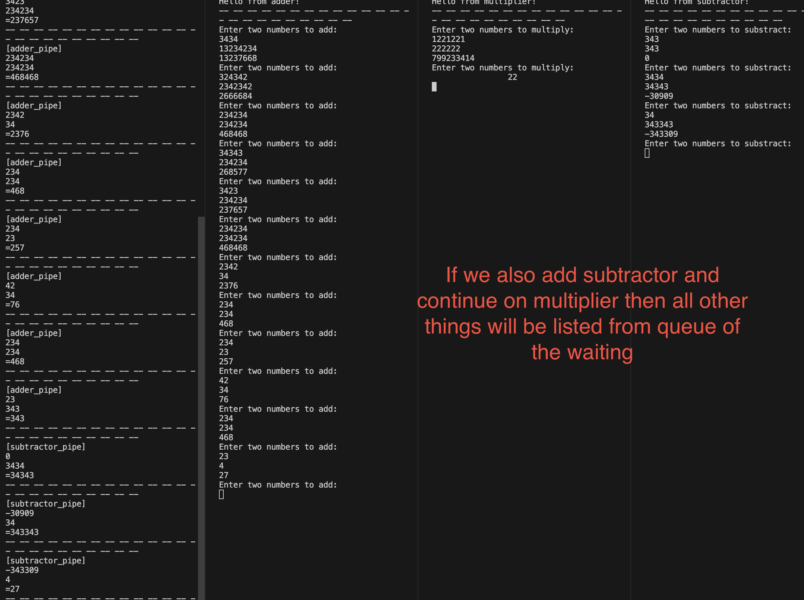

# os-worker-monitoring
Simple program that monitors the worker processes of the same project in the same directory.
 


# List of Contents:
- [Project Description](#project-description)
   - [Built With](#built-with)
   - [Libraries and Dependencies](#libraries-and-dependencies)
   - [Compatible With](#compatible-with)
- [Usage](#usage)
- [Project Structure](#project-structure)
- [Screenshots](#screenshots)
- [Code Documentation](#code-documentation)

---
# Project Description:
This project implements a worker monitoring system where a main program (`worker_monitor.c`) creates and monitors four worker threads (`adder.c`, `divider.c`, `multiplier.c`, and `subtractor.c`). Each worker thread reads data from its respective named pipe and performs calculations based on the received messages. The main program monitors these worker threads and displays the progress of their calculations.


#### Built With:

Programming Languages:
- C

Frameworks and Technologies:
- No frameworks used (only standard libraries)
- Only C standard libraries for Unix-like systems


#### Libraries and Dependencies:

- Standart Libraries --> Listed Only Important Ones:
    - `stdio.h`: Standard input/output functions.
    - `pthread.h`: Provides the pthread library for multithreading.
    - `unistd.h`: Declares symbolic constants and types for POSIX operating systems.
    - `fcntl.h`: File control options.
    - `sys/types.h`: Defines various data types.
    - `sys/stat.h`: Defines file status and mode constants.

- Dependencies:
   - [gcc](https://gcc.gnu.org/) (GNU Compiler Collection)

#### Compatible with:
```diff
+ Linux

+ MacOS

- Windows (needs to include Windows.h and change some functions)
```

---

# Usage:
firstly run makefile to compile the project
```bash
make
```
then run the monitor program
```bash
./worker_monitor
```
then run the worker programs in different terminals
```bash
./adder
./divider
./multiplier
./subtractor
```

---

# Project Structure:

```c
.
├── Makefile
├── Readme.md
├── adder
├── adder_pipe
├── divider
├── multiplier
├── multiplier_pipe
├── public
│   └── featured.jpg
├── src
│   ├── adder.c
│   ├── divider.c
│   ├── multiplier.c
│   ├── subtractor.c
│   └── worker_monitor.c
├── subtractor
├── subtractor_pipe
└── worker_monitor

39 directories, 88 files
```

---

# Screenshots:


---

---

---

# Code Documentation
### `worker_monitor.c`

The main program that initializes the mutex, creates worker threads, and monitors their activities. It uses named pipes (`adder_pipe`, `divider_pipe`, `multiplier_pipe`, and `subtractor_pipe`) for communication with the worker threads.

**Functions:**

- `void startCalculation(const char *workerName, const int worker_pipe, int *countOfMessages)`: Initiates the calculation process, reads messages from the named pipe, and displays the progress of the calculation.

- `void *workerThread(void *arg)`: Entry point for the worker thread. Opens the relevant named pipe for reading, listens for messages, and performs calculations based on the received data.

- `int main()`: The main function that initializes mutex, creates worker threads, and waits for them to finish. Responsible for cleaning up resources after thread execution.

### `adder.c` (Similar structure for other worker files)

The worker program responsible for addition calculations. It opens the relevant named pipe for reading, listens for messages, and performs calculations based on the received data. The worker thread is created by the main program (`worker_monitor.c`).

**Functions:**

- `void startCalculation(const char *workerName, const int worker_pipe, int *countOfMessages)`: Initiates the calculation process, reads messages from the named pipe, and displays the progress of the calculation.

- `void *workerThread(void *arg)`: Entry point for the worker thread. Opens the relevant named pipe for reading, listens for messages, and performs addition calculations based on the received data.

- `int main()`: The main function that initializes mutex, creates the worker thread, and waits for it to finish. Responsible for cleaning up resources after thread execution.

## Operating System Concepts

### Multithreading and Thread Synchronization

The project leverages pthreads (POSIX threads) for multithreading. The `pthread_mutex_t` lock is used for thread synchronization to ensure that only one thread focuses on printing its calculations at a time. This prevents potential race conditions and ensures orderly output.

### Interprocess Communication (IPC)

Named pipes are used for communication between the main program and worker threads. Each worker thread opens its respective named pipe for reading, allowing the main program to send messages to initiate calculations. This form of IPC facilitates communication between different parts of the program.

## Efficiency Considerations

### Thread Efficiency

The use of multiple worker threads enables parallel execution of calculations, leveraging the capabilities of modern multicore processors. The program uses mutex locks to synchronize threads, ensuring that only one thread accesses critical sections at a time.

### Time Complexity

The time complexity of the program is influenced by the efficiency of the threading mechanism and the nature of the calculations performed. Given the simplicity of the calculations and the parallel nature of the threads, the time complexity can be considered close to O(n), where n is the number of calculations performed.